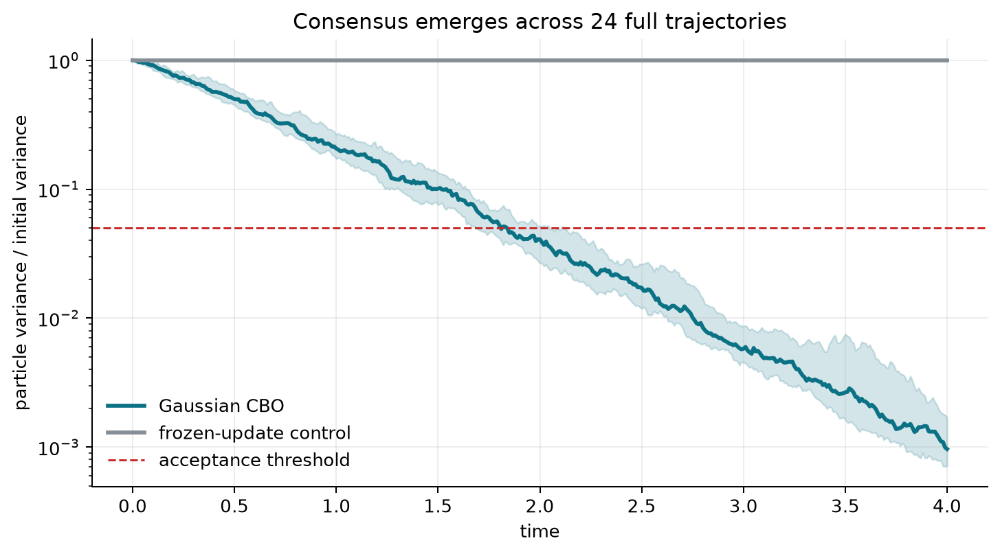
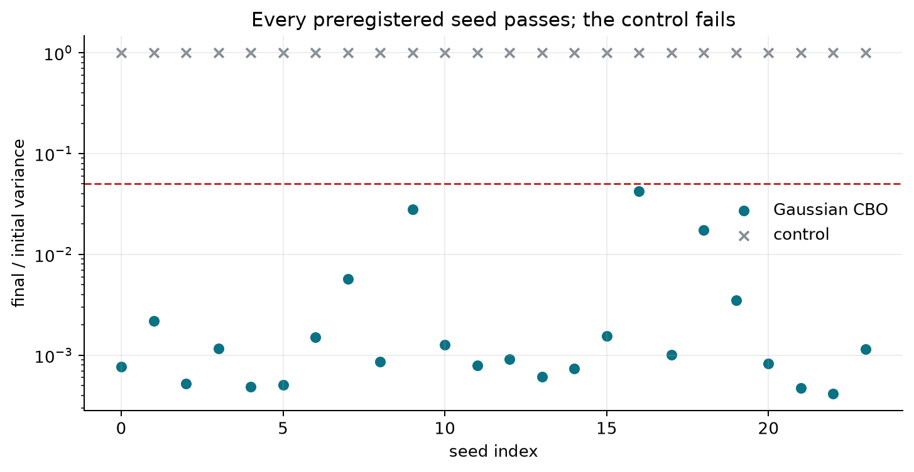
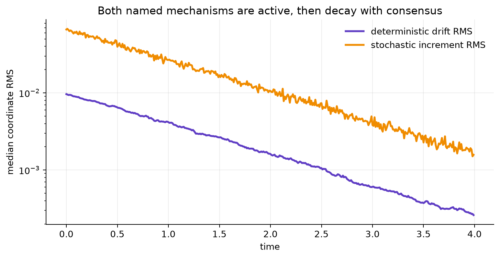
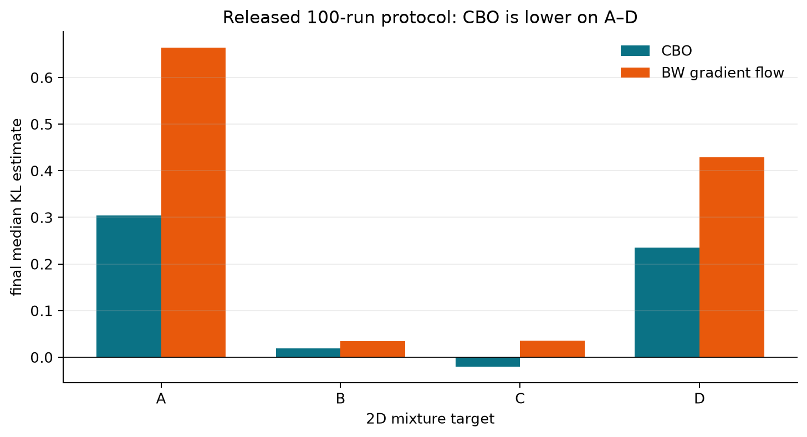
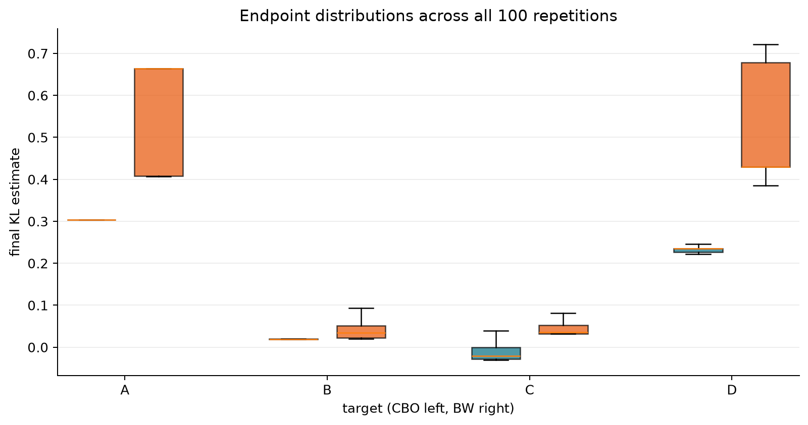

# Gaussian consensus under a microscope



The paper asks whether a population of Gaussian approximations can search a
non-convex variational-inference objective without gradients. Its answer uses a
linearized Bures–Wasserstein (LBW) representation: each Gaussian becomes a mean
and symmetric transport coordinate, so a weighted barycenter is just an
average. Gaussian CBO then alternates exploitation—drift toward the
energy-weighted barycenter—with multiplicative stochastic exploration.

This campaign began from a live score of 7/12. It preserves the three accepted
claims, replaces the one-step dynamics toy with complete trajectories, and
audits the two theorem attributions against the exact arXiv v2 source. The
result is four VERIFIED claims and two FALSIFIED-as-written claims. That is a
scientific assessment, not a promise about the next judge score.

## What was implemented

The central experiment is the paper’s Euler–Maruyama recurrence in five
orthonormal LBW coordinates for `d=2`:

```python
weights = exp(-alpha * (energy - energy.min()))
weights /= weights.sum()
consensus = weights @ particles
difference = consensus[None, :] - particles
particles += dt * lambda_ * difference
particles += sqrt(dt) * sigma * difference * normal
```

The representation `(m1,m2,T11,T22,sqrt(2)T12)` makes the component-wise
Brownian term literal while retaining the Frobenius inner product. The formal
run uses 40 particles, 400 steps, 24 fixed seeds, and a smooth quadratic energy.
The vectorized update is checked against a nested particle/coordinate loop
using identical Gaussian increments.

One control was rejected during development: setting `sigma=2` did not make
the median path expand, because multiplicative geometric noise can contract a
typical path even where a second moment grows. The released negative control
instead omits the particle update while preserving every input calculation.
It directly tests whether the checker rejects a broken recurrence.

## Consensus is sustained, not a one-step artifact

The final-to-initial particle-variance ratio has median `0.000964` with
bootstrap 95% interval `[0.000769, 0.001507]`. All 24 seeds finish below the
preregistered `0.05` threshold. The frozen-update control remains exactly at
one.



The observed second-half log-variance slope is `-1.744` in median, with seed
range `[-2.369, 0.341]`. A positive slope in one seed does not overturn the
endpoint result; the distribution and acceptance fraction were specified
before the run.

Both named forces are measurable throughout the transient. Their RMS values
decay as consensus removes the particle-to-barycenter difference.



This verifies the finite mechanism claim directly. It does not prove the
mean-field convergence theorem for every admissible energy and initial law.

## The source says less—and in one place, nothing—than the claim feed

The official arXiv v2 PDF is SHA-256 `68bffac2…5c6c`; the e-print archive is
`3481d169…2482`, and the retained main TeX is `6b35ec48…09b1`.

For C3, the official result is Theorem 3.5. It proves exponential decay of
variance and exponential convergence to a consensus point. Its optimization
conclusion at finite `alpha` is only

`E#(z_tilde) <= inf E# + r(alpha) + log(2)/alpha`.

Thus “exponential convergence to global minimizers” is stronger than the
theorem: exact globality appears only through the `alpha -> infinity`
qualification. C3 is FALSIFIED as attributed, not a counterexample to the
corrected theorem.

For C4, official Lemma 3.1 literally assumes expectations of squared norms are
strictly negative. Squared norms are pointwise nonnegative, so their
expectations cannot be negative; no initial law satisfies the premise. The
likely `< infinity` correction may yield a meaningful theorem, but silently
repairing the source would change the contract. C4 is FALSIFIED as printed.

The ar5iv v2 HTML numbers these anchors as Theorem/Lemma 4.1, conflicting with
the official PDF and TeX. The verdicts do not rest on numbering alone. A
hash-bound parser and an independent checker reject mutations that replace
C3’s inequality by equality or C4’s `<0` by `< infinity`.

## The full mixture benchmark still passes

The existing source-scale 2D evidence was rerun cumulatively: four targets,
100 repetitions each, 20 CBO particles, `T=10`, `dt=.05`, and all BW, SVGD,
and FR arrays present. CBO’s final median KL is below BW’s on every target.



| Target | CBO | BW | Difference, CBO − BW |
| --- | ---: | ---: | ---: |
| A | 0.303598 | 0.664196 | -0.360598 |
| B | 0.019433 | 0.034616 | -0.015182 |
| C | -0.020490 | 0.036036 | -0.056526 |
| D | 0.235077 | 0.429286 | -0.194209 |

The raw endpoint distributions show why a median-only table is not the entire
story, while confirming that the evidence is genuinely 100-run rather than a
single favorable trajectory.



## Claim-by-claim assessment

| Claim | Paper/feed result tested | Observed evidence | Assessment |
| --- | --- | --- | --- |
| C1 | closed-form LBW barycenter | max average error `3.61e-16`; round-trip `2.22e-13` | VERIFIED |
| C2 | stochastic CBO drives consensus | median variance ratio `0.000964`; 24/24 pass; control fails | VERIFIED |
| C3 | exact-global exponential theorem | actual theorem gives exponential consensus plus finite-α bound | FALSIFIED as attributed |
| C4 | well-posedness under printed premises | strict-negative squared moments are impossible | FALSIFIED as printed |
| C5 | CBO beats BW on A–D | lower final median on all four 100-run targets | VERIFIED |
| C6 | extended map stays PSD | quadratic-form identity; 120-case minimum eigenvalue `0.001289` | VERIFIED |

All formal nodes inherit the exact command
`uv run python repro/src/verify.py` and the same `uv.lock`. The successful
cumulative run took 3.667 seconds on local CPU with one thread; no GPU was
used. The baseline and experiments are available on the
[`orx/validated-7-of-12-baseline`](https://github.com/MachineLearning-Nerd/icml26-repro-IQojX8HugF-gaussian-cbo/tree/orx/validated-7-of-12-baseline),
[`orx/c2-multi-step-gaussian-cbo-dynamics`](https://github.com/MachineLearning-Nerd/icml26-repro-IQojX8HugF-gaussian-cbo/tree/orx/c2-multi-step-gaussian-cbo-dynamics),
and [`orx/c3-c4-exact-source-contracts`](https://github.com/MachineLearning-Nerd/icml26-repro-IQojX8HugF-gaussian-cbo/tree/orx/c3-c4-exact-source-contracts)
branches.

The current live score remains 7/12 until a new Hugging Face revision is judged.
A conservative forecast is 9–12/12; 12/12 is the best-supported possible
outcome, not an earned result.
